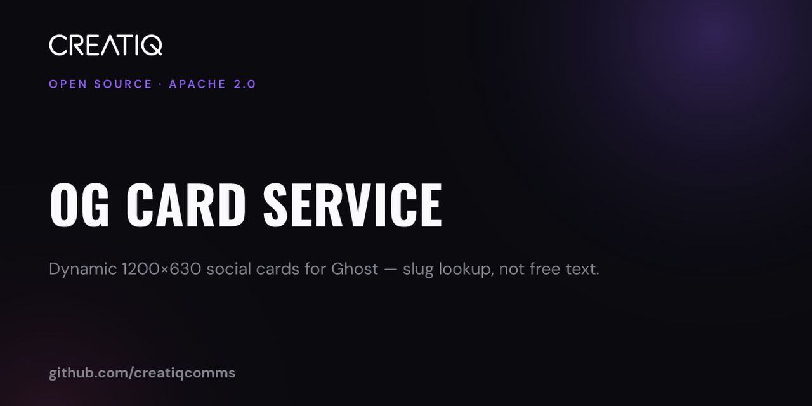

# OG Card Service



Dynamic **1200×630** Open Graph / X / Facebook / LinkedIn cards for [Ghost](https://ghost.org) sites — generated at request time so social crawlers can fetch a real image URL.

Confirmed in production against **Facebook** and **LinkedIn** Sharing Debugger / Post Inspector (Creatiq, September 2026). The same crawler contract applies to X, Slack, WhatsApp, and iMessage.

## Why a script on the page cannot do this

Facebook, X, LinkedIn, Slack, WhatsApp, and iMessage **do not execute JavaScript**. They fetch raw HTML, read `<meta property="og:image">`, then fetch that URL as an image file. Anything rendered only in the browser is invisible to them.

The fix is a small **image endpoint**: return a PNG, point the theme at it. Redesigns become a template change, not a re-export of every asset.

## WordPress and other CMSes

**Crawlers and the PNG renderer are CMS-agnostic.** Any site that can emit:

```html
<meta property="og:image" content="https://YOUR_OG_HOST/card?v=1&slug=…">
```

will get the same Facebook / LinkedIn behaviour once the endpoint returns `image/png` at 1200×630.

**This repository’s slug lookup is Ghost-specific** (Ghost Admin API). WordPress is not a drop-in:

| Layer | Ghost (shipped) | WordPress (not shipped) |
|---|---|---|
| Social crawlers | Works | Works the same |
| Card renderer (Satori → PNG) | Works | Reuse as-is |
| Slug → title / excerpt / eyebrow | Ghost Admin API | Needs a resolver — typically `GET /wp-json/wp/v2/pages?slug=` (or posts), or a small plugin |
| Theme / SEO plugin meta | Handlebars after `{{ghost_head}}` | Theme `wp_head` hook, or Yoast / Rank Math fallback when no featured / custom social image is set |

Precedence should stay the same: explicit social image → featured image → generated card. Yoast and Rank Math already emit Open Graph tags; wire the generator only as their fallback, the way Ghost’s site-wide default social image must be cleared after the endpoint is live.

A portable design is a thin **content provider** interface (`ghost` today; `wordpress` later) behind the same `/card` contract — or signed query params if you refuse a CMS API dependency. Neither WordPress path is implemented in this repo yet.

## Security model — slug lookup (not free text)

```
GET /card?v=1&slug=your-page-slug&type=page
```

The service resolves title, excerpt, and eyebrow **server-side** via the Ghost Admin API. Arbitrary text cannot be injected into your brand furniture.

Do **not** expose a public `?title=&sub=` text-to-image URL on your domain without signing — that lets anyone render words inside your card chrome.

## Precedence (Ghost theme)

1. Explicit social image (`og_image`) in the editor  
2. Feature image  
3. Generated card (only when neither exists)

See `docs/implementation-brief.md` for the full Handlebars block and deploy sequence (including clearing the site-wide default social image **after** the endpoint is live).

## Install

**Requirements:** Node.js 20+, a Ghost site, and a Ghost Admin API key (`keyid:secret`).

```bash
git clone <this-repo> og-card-service
cd og-card-service
cp .env.example .env
# Edit .env — set GHOST_API_URL, GHOST_ADMIN_API_KEY, OG_FOOTER_TEXT, etc.

npm install
npm run fetch:fonts          # downloads OFL fonts (not vendored in this repo)
cp assets/logo.placeholder.svg assets/logo.svg   # or point OG_LOGO_PATH at your mark
npm run build:fallback
npm start
```

Put a reverse proxy (nginx/Caddy) in front and point DNS at it. There is **no default public hostname** — set your own.

### Theme snippet (after `{{ghost_head}}`)

```hbs
{{#is "page"}}
{{#page}}
  {{#unless og_image}}{{#unless feature_image}}
  <meta property="og:image" content="https://YOUR_OG_HOST/card?v=1&slug={{slug}}&type=page">
  <meta name="twitter:image" content="https://YOUR_OG_HOST/card?v=1&slug={{slug}}&type=page">
  {{/unless}}{{/unless}}
{{/page}}
{{/is}}
<meta name="twitter:card" content="summary_large_image">
```

Mirror the same pattern for `{{#is "post"}}` / `{{#post}}` with `type=post`. Prefer feature/explicit images first (see the brief).

Bump `v` in the theme to cache-bust every card after a redesign.

## Configuration

| Variable | Required | Purpose |
|---|---|---|
| `GHOST_API_URL` | yes | Ghost origin (no trailing slash). **No default.** |
| `GHOST_ADMIN_API_KEY` | yes | `keyid:secret` Admin API key |
| `OG_FOOTER_TEXT` | recommended | Footer line on the card (e.g. your domain). **No vendor default.** |
| `OG_SITE_TITLE` | no | Fallback title |
| `OG_LOGO_PATH` | no | Path to your SVG wordmark (knockout / light-on-dark) |
| `OG_CACHE_DIR` | no | PNG cache directory |
| `PORT` | no | Default `8095` |
| `OG_BIND` | no | Default `127.0.0.1` |

Brand fonts (Oswald Bold, DM Sans Regular/SemiBold/Bold) are **not** committed. `npm run fetch:fonts` pulls OFL releases; keep the OFL text alongside if you redistribute those files.

## Endpoint contract

| Property | Value |
|---|---|
| Path | `/card` |
| Query | `v`, `slug`, `type` (`page` \| `post`) |
| Status | `200` (including static fallback on failure — never `500` for crawlers) |
| Content-Type | `image/png` |
| Size | 1200 × 630 |
| Cache-Control | `public, max-age=31536000, immutable` (safe because `v` busts) |


## Social preview

The hero above is [`docs/social-preview.png`](docs/social-preview.png) (1280×640 — GitHub’s recommended social size). It was rendered with this service so the README matches production cards.

To use it when the repo is shared on GitHub: **Settings → General → Social preview** → upload that file.

## Licence

- **Software:** [Apache License 2.0](LICENSE) — see also [NOTICE](NOTICE) and [TRADEMARK.md](TRADEMARK.md)
- **Documentation** in `docs/`: [CC BY 4.0](https://creativecommons.org/licenses/by/4.0/)

## Credits

Designed and originally operated by [Creatiq](https://www.creatiq.com). Architecture notes: `docs/implementation-brief.md`.
